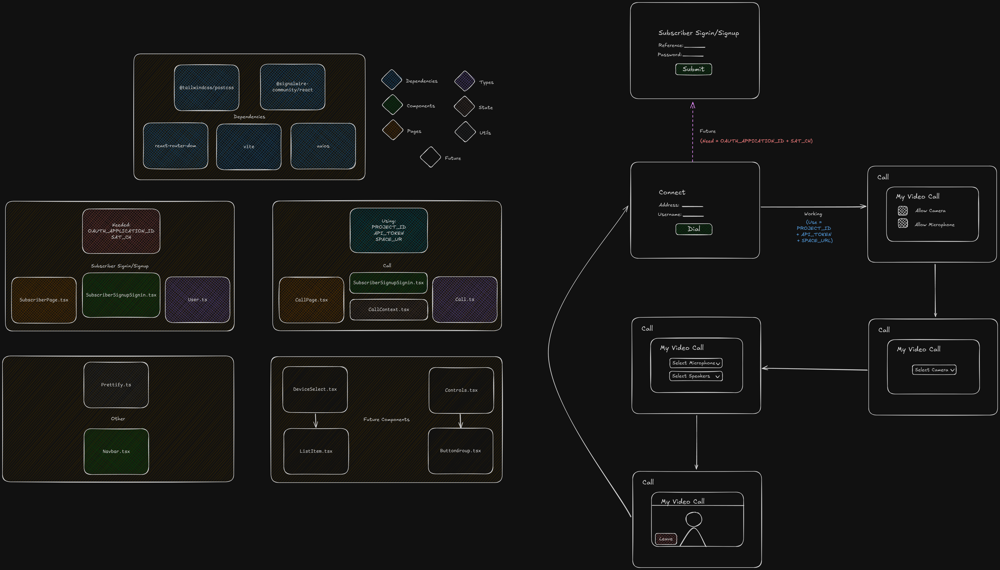

# Call Fabric Client

**SignalWire Call Fabric Client Beta** is a React-based web application designed to facilitate video conferencing and call management using the SignalWire API. This project provides a user-friendly interface for creating video rooms, managing a directory of callable addresses, handling subscriber authentication, and integrating with SignalWire's video conferencing capabilities.

The application leverages modern web technologies such as React, TypeScript, Tailwind CSS, and the SignalWire Community SDK to deliver a seamless video conferencing experience.

---

## Table of Contents

- [Features](#features)
- [Prerequisites](#prerequisites)
- [Installation](#installation)
- [Configuration](#configuration)
- [Usage](#usage)
- [Project Structure](#project-structure)
- [Components](#components)
- [Diagram](#diagram)
- [Dependencies](#dependencies)
- [Identified Issues](#identified-issues)
- [Contributing](#contributing)
- [License](#license)

---

## Features

- **Video Conferencing**: Create and join video rooms with customizable settings (e.g., room name, quality, layout).
- **Address Directory**: Manage a user-specific list of callable addresses, with options to add, delete, and call.
- **Subscriber Authentication**: Sign in or sign up using email, password, and name, with local storage persistence.
- **Call Management**: Initiate and disconnect calls with real-time status updates.
- **Responsive Design**: Built with Tailwind CSS for a modern, responsive UI.
- **State Management**: Centralized call and authentication state using React Context.

---

## Prerequisites

Before you begin, ensure you have the following installed:

- [Node.js](https://nodejs.org/) (v18 or higher recommended)
- [npm](https://www.npmjs.com/) (v9 or higher) or [Yarn](https://yarnpkg.com/)
- A SignalWire account with API credentials (Project ID, API Token, Space URL, etc.)

---

## Installation

1. **Clone the repository**:
   ```bash
   git clone https://github.com/your-username/call-fabric-client.git
   cd call-fabric-client
   ```

2. **Install dependencies**:
   ```bash
   npm install
   ```

3. **Set up environment variables** (see [Configuration](#configuration) below).

4. **Run the development server**:
   ```bash
   npm run dev
   ```
   The app will be available at `http://localhost:5173` (or another port if specified).

---

## Configuration

Create a `.env` file in the root directory based on the provided `.env.example`:

```env
VITE_PROJECT_ID=<your-signalwire-project-id>
VITE_API_TOKEN=<your-signalwire-api-token>
VITE_SPACE_URL=<your-signalwire-space-url>
VITE_OAUTH_APPLICATION_ID=<your-oauth-application-id>
VITE_SAT_CH=<your-sat-channel>
```

Replace the placeholder values with your SignalWire credentials. These are required for API authentication and video room creation.

---

## Usage

1. **Start the app**:
   ```bash
   npm run dev
   ```
   or
   ```bash
   npm start
   ```

2. **Access the app**:
   Open your browser and navigate to `http://localhost:5173`.

3. **Main Features**:
   - **Login/Register**: Navigate to `/login` to sign in or sign up with an email, password, and name.
   - **Call Console**: Enter a room name (or select from the directory) and click "Dial" to start a video call.
   - **Directory**: Add, delete, or call addresses stored locally for the authenticated user.
   - **Call Page**: Join an active video call and end it when finished.
   - **Subscriber Dashboard**: View user details and logout.

4. **Build for production**:
   ```bash
   npm run build
   ```

---

## Project Structure

```
call-fabric-client/
├── src/
│   ├── components/         # Reusable React components
│   │   ├── ButtonGroup.tsx
│   │   ├── CallConsole.tsx
│   │   ├── Directory.tsx
│   │   ├── ListItem.tsx
│   │   ├── Navbar.tsx
│   │   └── SubscriberSignupSignin.tsx
│   ├── pages/             # Page-level components
│   │   ├── App.tsx
│   │   ├── CallPage.tsx
│   │   └── SubscriberPage.tsx
│   ├── state/             # Context and state management
│   │   ├── AuthState.tsx
│   │   └── CallState.tsx
│   ├── types/             # TypeScript type definitions
│   │   ├── Address.ts
│   │   ├── Call.ts
│   │   └── User.ts
│   ├── utils/             # Utility functions
│   │   └── Prettify.ts
│   ├── index.css          # Global styles
│   └── main.tsx           # Entry point
├── public/                # Static assets
├── .env.example           # Example environment variables
├── package.json           # Project metadata and dependencies
├── tsconfig.json          # TypeScript configuration
├── vite.config.ts         # Vite configuration
└── tailwind.config.js     # Tailwind CSS configuration
```

---

## Components

### `ButtonGroup`
A reusable component that renders a group of buttons with customizable labels, click handlers, and styles.

### `CallConsole`
The main interface for initiating and managing video calls, including room creation and disconnection, with integration for address status updates.

### `Directory`
A component for managing a user-specific list of callable addresses, with options to add, delete, and initiate calls.

### `ListItem`
A styled list item component used in `Directory` and other lists for interactive elements.

### `Navbar`
A navigation bar with links to the home and subscriber pages.

### `SubscriberSignupSignin`
A form for subscriber authentication (signin/signup) with email, password, and name fields.

### `App`
The root component that sets up routing, authentication, and call state management.

### `CallPage`
Displays the active video call using SignalWire's `VideoConference` component and handles call termination.

### `SubscriberPage`
Displays authenticated user information and provides a logout option.

### `CallProvider` / `useCall`
Context and hook for managing call state (e.g., token, room name, user name) across the application.

### `AuthProvider` / `useAuth`
Context and hook for managing authentication state, including user login, registration, and logout.

---

## Diagram

Below is a placeholder for a diagram illustrating the application’s architecture or component flow.



---

## Dependencies

- **React**: Front-end library for building the UI (v19.0.0).
- **React Router**: For client-side routing (v7.3.0).
- **SignalWire Community SDK**: For video conferencing functionality (v1.4.2).
- **Axios**: For making HTTP requests to the SignalWire API (v1.8.2).
- **Tailwind CSS**: For styling the application (v4.0.11).
- **TypeScript**: For static typing and improved developer experience (v5.4).

See `package.json` for the full list of dependencies.

---

## Identified Issues

During development, several issues and design decisions were noted:

- **SignalWire SDK Choice**: The `@signalwire-community/react` package (v1.4.2) was chosen over `@signalwire/js` due to compatibility and stability issues encountered with the latter. The community package provides a more straightforward integration with React for video conferencing, though it may lack some lower-level control available in `@signalwire/js`.

If additional errors or issues arise, feel free to contact me for further assistance or clarification.

---

## Contributing

Contributions are welcome! To contribute:

1. Fork the repository.
2. Create a feature branch (`git checkout -b feature/your-feature`).
3. Commit your changes (`git commit -m "Add your feature"`).
4. Push to the branch (`git push origin feature/your-feature`).
5. Open a pull request.

Please ensure your code follows the existing style and includes tests where applicable.

---

## License

This project is licensed under the MIT License. See the [LICENSE](LICENSE) file for details.
